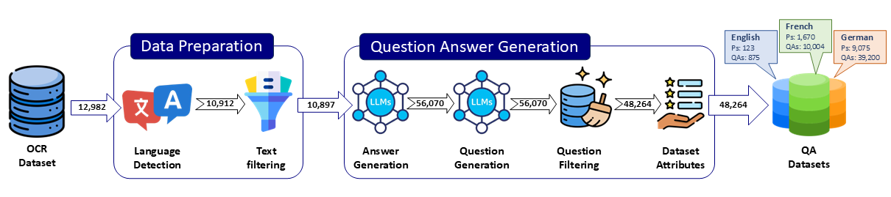

<span align="center">
    <a href=""></a>
</span>
<a href=""></a>
<a href=""></a>

# MultiOCR-QA: Dataset for Evaluating Robustness of LLMs in Question Answering on Multilingual OCR Texts



MultiOCR, **a multilingual QA** dataset designed to assess the impact of OCR errors on QA systems across English, French, and German. Our dataset, derived from centuries-old documents, provides a unique evaluation of OCR-induced challenges in real-world applications.


## 🗃️Dataset

### Dataset Statistics
|                                   | English | French   | German |
| --------------------------------  | --------| ---------| ------ |
|            #QA pairs              | 10,875  | 10,004   | 39,200 | 
|           #Paragraphs             | 6,525   | 1,670    | 9,075  |
| Average paragraph length (words)  | 219.09  | 297.53   | 212.86 | 
| Average question length (words)   | 10.98   | 8.73     | 8.08   |
| Average answer length (words)     | 2.05    | 3.12     | 5.63   |
| Average questions per paragraph   | 1.67    | 5.99     | 4.32   |


**Data Structure**: 
```json
{
    "document_id": "",
    "rawOCR_text": "",
    "correctedOCR_text": "",
    "QA_pairs": [
        {
            "q_id": "",
            "question": "",
            "answer": ""
        }
    ]
}
```
## 🪪License
This project is licensed under the MIT License - see the [LICENSE](LICENSE) file for details.

## ✨Citation
If you find this work useful, please cite [📜our paper]():
### Plain

### Bibtex
```bibtex

```

## 🙏Acknowledgments
Thanks to our contributors and the University of Innsbruck for supporting this project.

