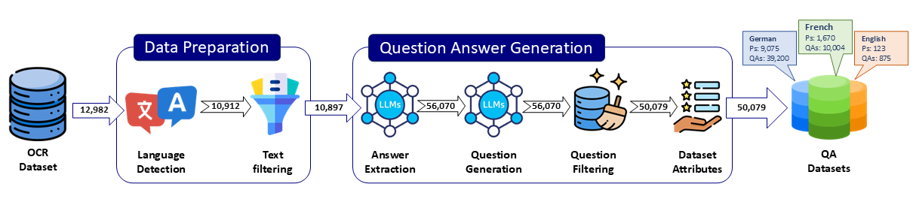

<span align="center">
    <a href="https://huggingface.co/datasets/Bhawna/MultiOCR-QA/tree/main"></a>
</span>
<a href="https://arxiv.org/pdf/2502.16781v1"></a>
<a href=""></a>

# Evaluating Robustness of LLMs in Question Answering on Multilingual Noisy OCR Data



**MultiOCR-QA** is a large-scale multilingual QA dataset designed to evaluate how OCR noise—insertions, deletions, substitutions—affects Large Language Models (LLMs) in question answering. Unlike standard QA datasets, MultiOCR-QA provides both RawOCR (noisy OCR text) and CorrectedOCR (ground truth text), enabling direct measurement of robustness and testing of noise-mitigation strategies.

## 🗂 Overview

### **📌 Key Statistics**
- **50,000** QA pairs across **English, French, German.**.  
- Derived from **centuries-old historical documents** (via ICDAR 2019 dataset)
- Each sample includes both **RawOCR** and **CorrectedOCR** contexts.

### **🌟 What Makes PlausibleQA Unique?**
✅ **Dual OCR Contexts**: Direct comparison between noisy and clean text for every QA pair.

✅ **Fine-grained Noise Profiling:** Error categories (insertions, deletions, substitutions) and low/medium/high noise levels.

✅ **Multilingual & Historical:** Covers **EN/FR/DE** historical corpora with diverse OCR challenges.

✅ **Robustness Benchmark:** Evaluates state-of-the-art LLMs under realistic OCR distortions.

### **🔑 Research Contributions**
1. **Introduction of MultiOCR-QA**:
    - First large multilingual QA dataset for systematic OCR-noise evaluation.
    - Features **50K QA pairs** with paired noisy/clean contexts.

3. **Comprehensive Model Evaluation**
    - Benchmarked **Qwen, LLaMA, Gemma, Mixtra**l across EN/FR/DE.
    - Shows consistent degradation from RawOCR vs CorrectedOCR.

4. **Mitigation Strategies**
    - Explored **context correction** (fix noisy passages before QA).
    - Compared with **answer correction** (post-process generated answers).
    - Findings: **Correcting context early** is more effective than fixing answers afterward.

## 🗃️Dataset

### Dataset Statistics
|                                               | English | French   | German |
| --------------------------------              | --------| ---------| ------ |
|            #QA pairs                          | 875     | 10,004   | 39,200 | 
|           #Paragraphs                         | 123     | 1,670    | 9,075  |
| Average CorrectedOCR paragraph length (words) | 271.73  | 297.53   | 212.86 | 
| Average RawOCR paragraph length (words)       | 263.46  | 335.73   | 193.23 | 
| Average question length (words)               | 8.60    | 8.73     | 8.08   |
| Average answer length (words)                 | 2.05    | 3.12     | 5.63   |
| Average questions per paragraph               | 7.11    | 5.99     | 4.32   |


**Data Structure**: 
```json
{
    "document_id": "",
    "rawOCR_text": "",
    "correctedOCR_text": "",
    "QA_pairs": [
        {
            "q_id": "",
            "question": "",
            "answer": ""
        }
    ]
}
```
## 📥 Dataset Download
The dataset is available on [HuggingFace](https://huggingface.co/datasets/Bhawna/MultiOCR-QA):
- **English QA**: [Download](https://huggingface.co/datasets/Bhawna/MultiOCR-QA/resolve/main/English.json?download=true)
- **French QA**: [Download](https://huggingface.co/datasets/Bhawna/MultiOCR-QA/resolve/main/French.json?download=true)
- **German QA**: [Download](https://huggingface.co/datasets/Bhawna/MultiOCR-QA/resolve/main/German.json?download=true)

## **📂 Use Cases of PlausibleQA**
- **Training noise-resilient LLMs**:
    - Improve robustness against OCR inaccuracies by exposing models to paired **RawOCR vs. CorrectedOCR contexts.**

- **Error correction research**
    - Develop and evaluate correction pipelines that fix OCR errors while preserving the **archaic language structure** of historical documents.

- **Multilingual robustness**
    - Expand LLMs’ capabilities beyond English by training and evaluating on **English, French, and German** OCR text.

- **Digital humanities & archives**
    - Enhance accessibility of **centuries-old documents** by enabling robust QA over noisy digitized collections.

- **Generalizable NLP research**
    - Use OCR noise as a case study for broader **robustness, perturbation, and domain shift** evaluations.

## 🪪License
This project is licensed under the MIT License - see the [LICENSE](LICENSE) file for details.

## ✨Citation
If you find this work useful, please cite [📜our paper](https://arxiv.org/pdf/2502.16781v1):
### Plain
Piryani, B., Mozafari, J., Abdallah, A., Doucet, A., & Jatowt, A. (2025). Evaluating Robustness of LLMs in Question Answering on Multilingual Noisy OCR Data. arXiv preprint arXiv:2502.16781
### Bibtex
```bibtex
@article{piryani2025multiocr,
  title={Evaluating Robustness of LLMs in Question Answering on Multilingual Noisy OCR Data},
  author={Piryani, Bhawna and Mozafari, Jamshid and Abdallah, Abdelrahman and Doucet, Antoine and Jatowt, Adam},
  journal={arXiv preprint arXiv:2502.16781},
  year={2025}
}

```

## 🙏Acknowledgments
Thanks to our contributors and the University of Innsbruck for supporting this project.

